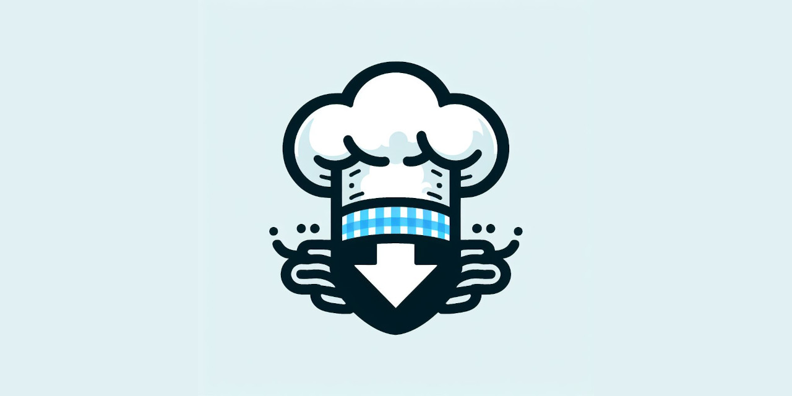

<a name="readme-top"></a>
# Cuisto



CLI tool allowing you to write and execute "recipes".

- 🍕 **Quickly bootstrap your projects** by setting up the file structure and installing all your tools and frameworks using only one command. Abstraction for the most common configuration files such as Docker compose, dotenv, yaml, gitignore and more are available.
- 🍪 **Execute repetitive commands and manipulate templated files** in order to fasten repetitive tasks.
- 🍱 **Interactively let the user choose his configuration** with the power of CLI inquiries.

**/!\ Please be careful when using recipes from untrusted sources, since it can execute commands, read, write and delete files.**


## Installation

`cuisto` requires git and Node 18+ to run (but we suggest you install or use the latest LTS). Install it using pnpm, npm or whatever you prefered package manager may be:

```bash
npm install -g @lazybobcat/cuisto-cli
```

*`cuisto` is also available as a Docker image: `docker run --rm -it -v $(pwd):/app -u $(id -u):$(id -g) lazybobcat/cuisto <command>`. See [cuisto's Docker Hub repository](https://hub.docker.com/r/lazybobcat/cuisto) for more information.*

<p align="right">(<a href="#readme-top">back to top</a>)</p>

## Usage

### Install a recipe

To execute a recipe hosted on GitHub, simply use the install command:

```bash
cuisto install <recipe> [branch]
```

where `<recipe>` is the `<owner>/<repository>` of the recipe repository (`cuisto` will look for a `schema.json` file). By default the `main` branch will be used, but you can override it by passing a `[branch]` option, allowing you to manage recipe versions.

You can also install recipes that are located on your computer or server by providing a relative path (starting with `.`) or an absolute one:

```bash
cuisto install /path/to/my/recipe
```

You can add or override recipe sources in the configuration, for example if your recipe is not on GitHub but on Gitlab. See [Configuration](#configuration) if you find yourself in this situation.

```json
{
    "$schema": "https://raw.githubusercontent.com/lazybobcat/cuisto/main/cuistorc.schema.json",
    "name": "<projectName>",
    "recipe_sources": []
}
```

### Initialize a cuisto configuration file

Quickly generate the `cuisto` configuration file in your project by executing:

```bash
cuisto init [project-name]
```

### Generate a cuisto recipe boilerplate code

Recipes all have a `schema.json` and a main javascript module, to initialize them with useful information why not use the `new-recipe` recipe?

```bash
cuisto new-recipe <recipe-name>
```

You can find the full documentation of how to write recipes on [the wiki](https://github.com/lazybobcat/cuisto/wiki).

<p align="right">(<a href="#readme-top">back to top</a>)</p>

## Configuration

`cuisto` can use a per-project configuration by reading a `.cuistorc.json` file. This file can be created for you by running the `cuisto init` command.

You can provide your configurations as JSON key-values, here are the available configurations:

- `"name"` (optional): the value is a string containing the project name. It can be useful for recipes to use in file templates.
- `"recipe_sources"`: an array of strings representing the places to look for recipes. For example, if you have a Gitlab group that contain all your recipe, you can provide a git link to that group (ie: `"git@gitlab.com:<myorg>/<mygroup>"`). Recipes will be looked for in that group (ie: `cuisto install customrecipe` will try to look for the `git@gitlab.com:<myorg>/<mygroup>/customrecipe.git` repository).

<p align="right">(<a href="#readme-top">back to top</a>)</p>

## Important links and documentations

You can find more detailed information and examples following these links:

- [Cuisto wiki](https://github.com/lazybobcat/cuisto/wiki)
- [Cuisto's Docker Hub repository](https://hub.docker.com/r/lazybobcat/cuisto)

<p align="right">(<a href="#readme-top">back to top</a>)</p>

## License

Licensed under the [MIT](https://choosealicense.com/licenses/mit/) license, Copyright 2024 Loïc Boutter and other contributors. [Copy of the licence](https://github.com/lazybobcat/cuisto/blob/main/LICENSE).

<p align="right">(<a href="#readme-top">back to top</a>)</p>
